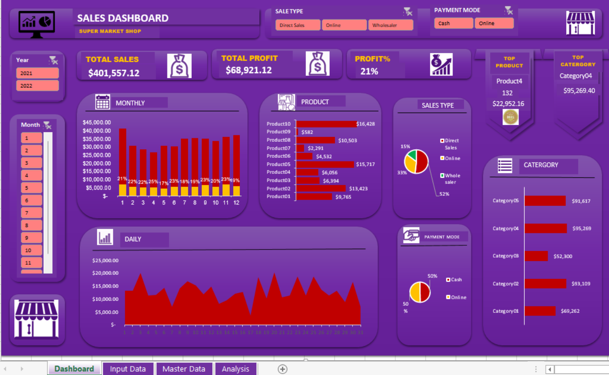

# Supermarket sales analysis

    

Sales analysis is very vital to any business trying to make a profit as it helps understand customer preferences, buying patterns, and product demand. By analyzing sales data, businesses can identify top-selling products, optimize inventory levels, and tailor marketing strategies to meet customer needs. This insights-driven approach enables businesses to improve profitability, enhance customer satisfaction, and stay competitive in the market.

## Introduction
---

This is an Excel project that analyzes and derive sales insights for a supermarket.I also took a look at products ,categories,types of payment and type of sale as they have an impact on the sales.

**_Disclaimer_**  :  _The data set was taken from Kaggle_

## Problem statement
---

1. Monthly,daily sales?
2. Identify the  KPIs in sales?

## Skills/concepts demonstrated
---

The following Excel features were incorporated:
-	Pivot tables,
-	Slicers,
-	Filters,
-	VLOOKUP functions,
-	OFFSET functions
-	Pivot charts .

## Visualization
---

The excel file include 4 pages
1.	Dashboard
2.	Input data
3.	Master data
4.	Analysis

You can interact with the **Report** 

## Analysis:
---

 
