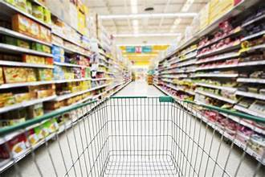

# Supermarket sales analysis

    

Sales analysis is very vital to any business trying to make a profit as it helps understand customer preferences, buying patterns, and product demand. By analyzing sales data, businesses can identify top-selling products, optimize inventory levels, and tailor marketing strategies to meet customer needs. This insights-driven approach enables businesses to improve profitability, enhance customer satisfaction, and stay competitive in the market.

## Introduction
---

This is an Excel project that analyzes and derive sales insights for a supermarket.I also took a look at products ,categories,types of payment and type of sale as they have an impact on the sales.

**_Disclaimer_**  :  _The data set was taken from Kaggle_

## Problem statement
---

1. Monthly,daily sales?
2. Identify the  KPIs in sales?

## Skills/concepts demonstrated
---

The following Excel features were incorporated:
-	Pivot tables,
-	Slicers,
-	Filters,
-	VLOOKUP functions,
-	OFFSET functions
-	Pivot charts .

## Visualization
---

The excel file include 4 pages
1.	Dashboard : Interactive Dashboard with visuals.
2.	Input data : This sheet has to be updated on regular basis to capture actual sales data.
3.	Master data : This is the product catalog sheet,which has to be updated on the addition/deletion of the product from the list.
4.	Analysis : This sheet includes all backend calculations done to visualize the data from the input sheet.

You can interact with the **Report** [here](https://github.com/maudrues/Supermarket_sales_analysis/blob/main/Supermarket_%20Sales_Dashboard_%20in_excel.xlsx)

## Analysis:
---

 

As we can see from the above dashboard for both years 2021 and 2022 our top product is product41 with a revenue of $22 952 from which 132 units have been sold.The most famous category of products being sold  is catergort04 which is generating revenue of  whooping $95 269.Direct sales are more popular compared to wholesaling .Customers eaqually prefer both using cash and paying online.In 2021 online payments were more popular but come 2022 it's vice versa.In 2022 the supermarket's profit increased by 3% which is the good as the business is progressing.
